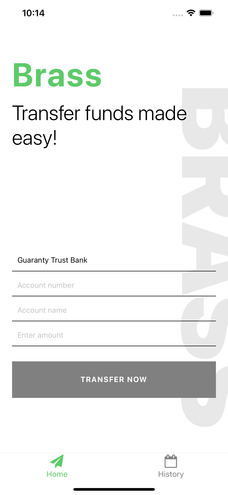
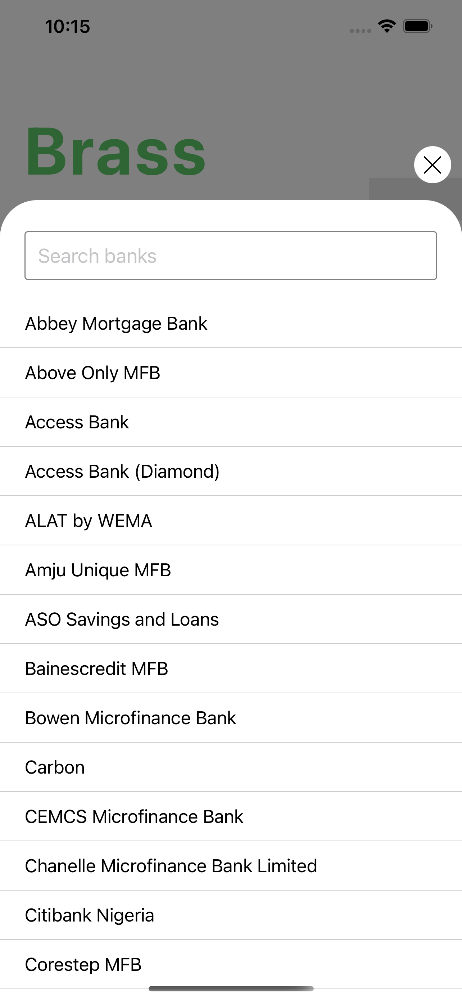
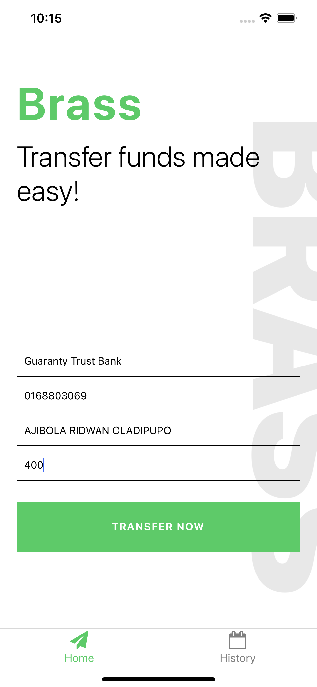
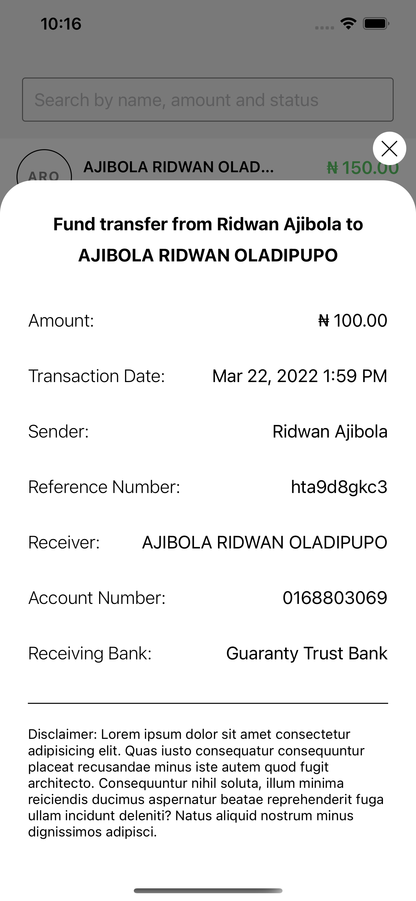

# Brass Mobile App [](https://app.circleci.com/pipelines/github/rajibola/brass)

## Preview

### [Preview live demo](https://drive.google.com/file/d/1wsDNF5vyWIkslF4tvxPmOnvKoDzvLzcw/view?usp=sharing)

<span>




</span>

## Getting Started

- Fork or Clone the repo, then set it up:

```
$ cd brass
$ yarn install
```

### Run on Android

```
$ yarn run android
```

### Run on iOS

```
$ cd ios && pod install
$ cd .. && yarn run ios
```

## Task

1. An interface for creating a new payment (that is, fund transfers)
   a. It allows the customer select the bank and provide the destination account number (the account number must be validated before proceeding)
   b. It allows the user enter an amount that is bound by the rules on ≥ 100 and 10,000,000
   c. Sends the payment information to the API for processing
2. An interface that allows a user see all payments they've ever created and view the details on any one that's selected

## Solution

1. Used Paystack APIs to `verify account`, `get banks`,`get all transfers`, `initiate transfer` and `create recipient`.
2. Created two interface as per the instruction given above, one for the fund transfer and the other for displaying transaction history.
3. Made use of modal for view transaction and select bank views.
4. Made the design from inspirations found on the brass mobile app on AppStore.
5. Write unit tests for screens, components and functions.
